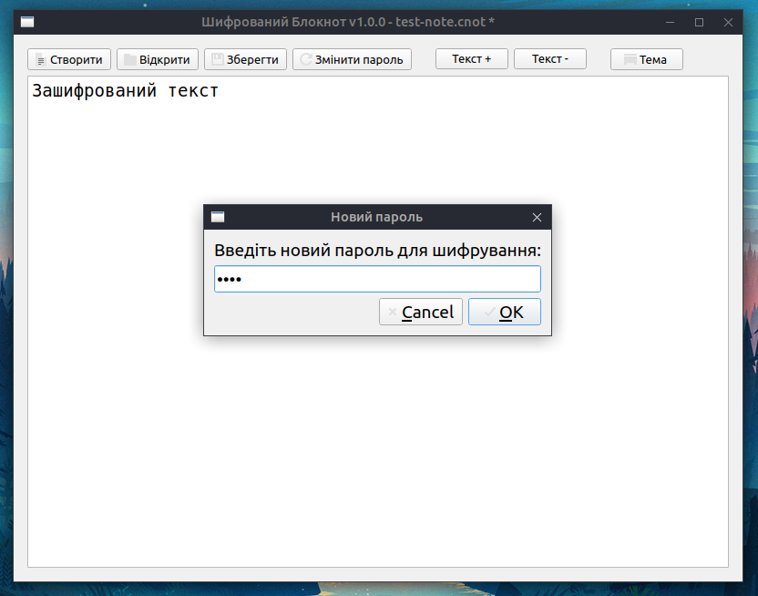

# CryptoNote v1.1.0



**CryptoNote** — це легкий, сучасний та безпечний графічний текстовий редактор для Linux та Windows, створений на базі Python (PyQt6). Він працює як звичайний "Блокнот", але з акцентом на безпеку: всі ваші записи надійно шифруються за допомогою алгоритму AES-256 та захищаються паролем.

## Основний функціонал 🚀

* **Надійне шифрування:** Використовує алгоритм Fernet (симетричне шифрування на базі AES-128 в режимі CBC з 256-бітним ключем), ключі генеруються через PBKDF2 (100,000 ітерацій SHA256 + унікальна сіль для кожного файлу).
* **Просте керування паролями:** 
  * При першому збереженні файлу програма запитує пароль.
  * Пароль запам'ятовується в оперативній пам'яті на час активної сесії роботи з документом. Це дозволяє зберігати файл одним кліком без постійного вводу пароля.
  * Пароль миттєво стирається з пам'яті при відкритті іншого файлу, створенні нового або закритті програми.
  * Функція зміни пароля "на льоту" дозволяє легко оновити пароль до поточного файлу.
* **Сучасний інтерфейс (UI):**
  * Інтуїтивно зрозуміла панель кнопок із системними іконками.
  * Вікно відкривається завжди по центру екрана.
  * Можливість масштабувати текст (Текст + / Текст -) для комфортного читання.
  * Власні світла та темна теми, які можна перемикати одним кліком. Програма запам'ятовує ваш вибір теми.
* **Захист від втрати даних:** 
  * Програма відстежує всі зміни в тексті (позначка `*` у заголовку).
  * При спробі закрити програму або відкрити інший файл без збереження, з'явиться попередження з пропозицією зберегти зміни.
  * Захист від помилок при вводі пароля (надається 3 спроби при відкритті файлу).
* **Системна інтеграція:** Файли з розширенням `.cnot` можна відкривати подвійним кліком прямо з провідника файлів (через `cryptonote.desktop`).

## Встановлення та запуск ⚙️

1. Переконайтеся, що у вас встановлено Python 3.
2. Встановіть необхідні залежності:
   ```bash
   pip3 install -r requirements.txt
   ```
3. Запустіть програму:
   ```bash
   python3 main.py
   ```

## Формат файлу (.cnot) 🔒

Файли зберігаються з розширенням `.cnot`. Вони є бінарними та складаються з двох частин:
1. **Сіль (16 байт):** Згенерована випадковим чином при кожному збереженні (захист від rainbow tables).
2. **Зашифрований текст:** Створений за допомогою бібліотеки `cryptography` на основі вашого пароля та солі.

## Оновлення безпеки (v1.1.0) 🛡️

У версії 1.1.0 було виправлено ряд потенційних вразливостей, виявлених під час аудиту безпеки:
* **Підтвердження пароля:** Додано подвійний ввід пароля при збереженні нового файлу та зміні пароля, що унеможливлює втрату доступу через друкарську помилку.
* **Мінімальна довжина пароля:** Встановлено обмеження на мінімальну довжину пароля (від 6 символів) для захисту від швидкого brute-force підбору.
* **Захист пам'яті:** При закритті програми розшифрований текст та кешований пароль гарантовано видаляються з пам'яті графічного інтерфейсу (через явне очищення віджета перед закриттям).
* **Права доступу:** Файл налаштувань `~/.cryptonote_settings.json` тепер зберігається з суворими правами доступу (`600`), що унеможливлює його читання або модифікацію іншими користувачами системи.
* **Автоматичний фокус:** Для зручності курсор тепер автоматично переміщується в кінець тексту після розшифрування файлу, дозволяючи відразу продовжувати роботу.

---
*Створено з турботою про безпеку ваших нотаток.*
